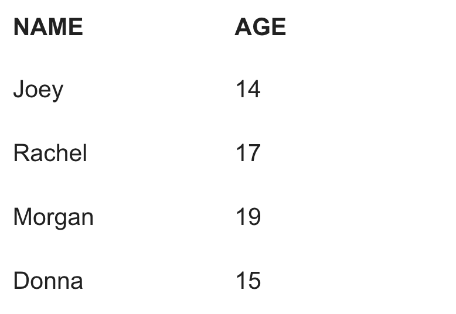
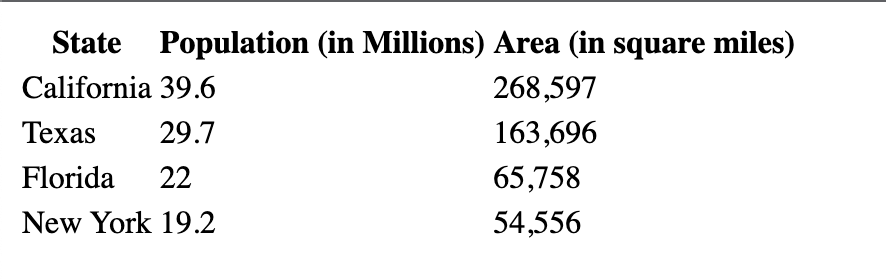
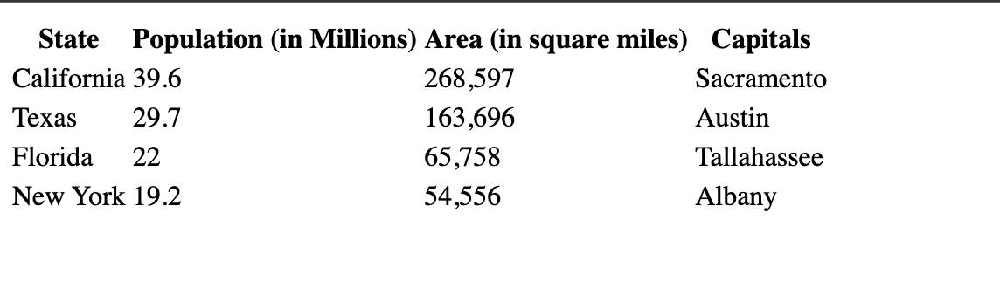

# Creating Tables 

We can use nested HTML elements to create a table. Use ```<table>``` tags to create a table.

Here is a breakdown of the HTML code for a table. On the left is the HTML code and the right is how it will display:


 ## Task 1
 
Let's make a table step by step. First, create an opening and closing ```<table>``` tags like this:

```<table>```

```</table>```

Leave a line space in between the opening and closing ```table``` tags.

## Task 2

Nested inside the ```<table>``` tags should be ```<tr>``` or TABLE ROWS, representing each horizontal ROW.

Add an opening and closing ```<tr>``` tag in between the ```<table>``` tags like this:

```
<table>
      <tr>
      
      </tr>
</table>

```

Leave a line space in between the opening and closing ```tr``` tags.

## Task 3

Nested inside of the Table Rows ```<tr>``` tags should be ```<td>``` or TABLE DATA tags. These represent the individual cells or COLUMNS in a row.  You write your content inside of the ```<td>``` tags.  The more ```<td>``` tags you write in between a ```<tr>``` tag, the more columns.

** Add an opening and closing ```<td>``` tag in between the ```<tr>``` tags like this: **

```
<table>
  <tr>
    <td> </td>
  </tr>
</table>

```

## Task 4

** Add another opening and closing ```<td>``` tag and between the ```<tr>``` tags. Add some content. like this: **

```
<table>
    <tr>
        <td>Name</td>
        <td>Age</td>
    </tr>
</table>

```

Run the code.  You have created one row in a table.

## Task 5

Now we will create a second row.

**Add another row with content beneath your first row like this:**

```
<table>
    <tr>
      <td>Name</td>
      <td>Age</td>
    </tr>
    <tr>
      <td>Jaime</td>
      <td>14</td>
    </tr>
</table>

```

Run the code. Now you have two rows with content.

## Task 6

** You can use ```<th>``` or TABLE HEADER tags instead of ```<td>``` tags if you want the text to be bold.  Replace the ```td``` tags in your first row to ```<th>``` It should look like this: **


## TASK 7

** Rereate the table below by adding more rows and content to your existing table. **



## Task 8

Recreate the table below.



## Task 9

Add a fourth column with the Capitals of each state. Like this:



We will learn how to add borders and style to our tables in the next lesson.

